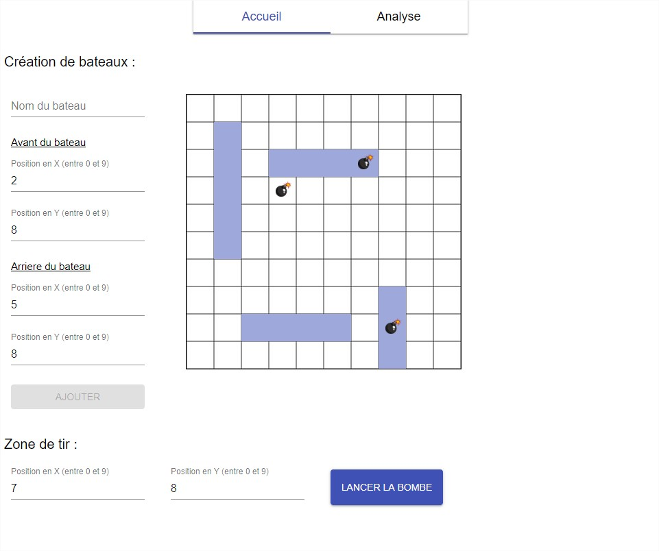
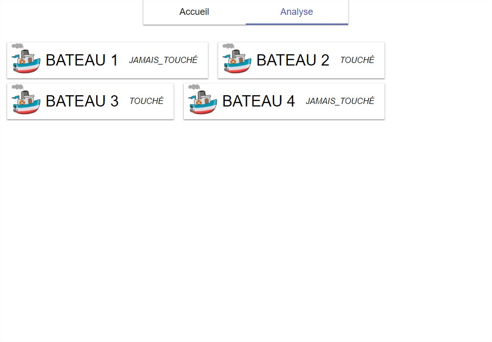

= Entretien technique
Front

== Objectif

Fournir le code source (lien vers un dépôt GIT) du jeu de la bataille navale/touché-coulé pour un joueur.

== Attentes

Une application front autonome qui fonctionne.

L’application est composée de deux pages. La première permet de créer des bateaux et d’effectuer des tirs, la deuxième permet d’afficher un compte rendu de l’état des bateaux. On navigue entre les deux pages sans perdre les données (le F5 réinitialise la partie).

Tous les frameworks et outils peuvent être utilisés.

Il y a deux stacks fournies (init basique) dans les sous-dossiers suivants :

- ./react-js : React JS
- ./react-ts : React TS

Elles sont là pour faciliter la mise en place de la stack mais ne sont pas obligatoires, vous êtes libre de les utiliser ou non. Vous pouvez également proposer une autre stack.

Voici des maquettes des deux pages.
Les maquettes sont des exemples, vous avez le choix de la mise en page.
La grille représentant la partie est optionnelle.

=== Première page

Lorsque l’utilisateur effectue un tir, le système calcul s’il y a un bateau touché ou coulé par rapport aux bateaux précédemment créés. Il est possible d’effectuer un tir puis de créer des bateaux et de faire de nouveaux tirs.

Créer des bateaux

- On part du principe que les bateaux ne se chevauchent pas
- Ils sont horizontaux ou verticaux
- L’avant (front) est plus éloigné que l’arrière (rear) de l’origine (0, 0)
- Pas besoin de vérifier ces règles dans le code.

L’utilisateur peut rentrer les coordonnées avant et arrière d’un bateau ainsi que son nom (avec des inputs par exemple).

Il peut créer autant de bateau qu’il le souhaite.

.Exemple JSON d’un bateau
[source,javascript] 
----
{ "name" : "nemesis", "rear": { "x": 3, "y": 4 }, "front": { "x": 3, "y": 6 } }
----

Effectuer des tirs

- Il n’y a pas deux tirs aux mêmes coordonnées (pas besoin de vérifier cette règle).
- Affiche une popup avec le statut du tir : “MISSED”, “HIT”, “SUNK”

.Exemple JSON d’un tir
[source,javascript] 
----
{ "x": 3, "y": 5 }
----

.Exemple du message de la popup
----
HIT
----

=== Deuxième page

La Deuxième page affiche l’état des bateaux. Il est possible de naviguer entre les deux pages n’importe quand, les données ne sont pas perdues.

Cette page doit afficher un ensemble de tuiles. Chaque tuile donne le nom d’un bateau ainsi que son état : “HIT“, “SUNK“, “NEVER_HIT“.

Les tuiles doivent être alignées horizontalement et sur plusieurs lignes (dès que le nombres de bateaux ne permet plus l’affichage sur une ligne).

== Exemple d’une partie avec du JSON

=== Création d’un bateau

[cols="4a,2a"]
|===
|.Input
[source,javascript] 
----
{ "name": "600i", "rear": { "x": 3, "y": 4 }, "front": { "x": 3, "y": 6 } }
----
|image::images/Diapositive2.PNG[]
|===

=== Création d’un bateau

[cols="4a,2a"]
|===
|.Input
[source,javascript] 
----
{ "name": "vanguard", "rear": { "x": 0, "y": 1 }, "front": { "x": 1, "y": 1 } }
----
|image::images/Diapositive3.PNG[]
|===

=== Réalisation d’un tir

[cols="4a,2a"]
|===
|.Input
[source,javascript] 
----
{ "x": 2, "y": 2 }
----

.Popup
----
MISSED
----
|image::images/Diapositive4.PNG[]
|===

=== Réalisation d’un tir

[cols="4a,2a"]
|===
|.Input
[source,javascript] 
----
{ "x": 0, "y": 1 }
----

.Popup
----
HIT
----
|image::images/Diapositive5.PNG[]
|===

=== Réalisation d’un tir

[cols="4a,2a"]
|===
|.Input
[source,javascript] 
----
{ "x": 3, "y": 5 }
----

.Popup
----
HIT
----
|image::images/Diapositive6.PNG[]
|===

=== Réalisation d’un tir

[cols="4a,2a"]
|===
|.Input
[source,javascript] 
----
{ "x": 1, "y": 1 }
----

.Popup
----
SUNK
----
|image::images/Diapositive7.PNG[]
|===